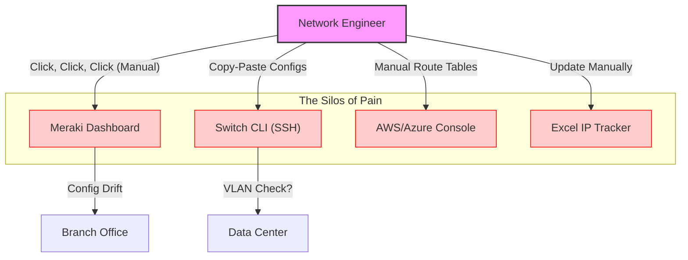
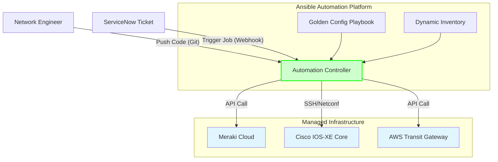
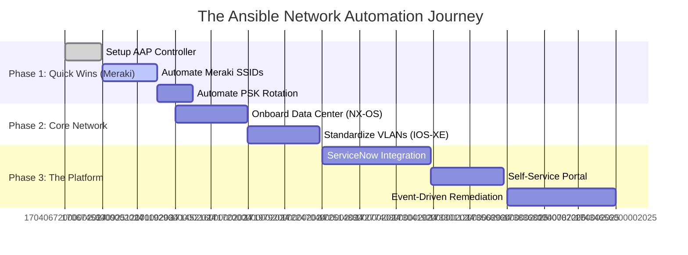

# Visual Diagrams: The Automation Story

## 1. The "Before" State: Manual Chaos (The Problem)
This diagram illustrates the "Swivel Chair" management style. Notice how the Network Engineer is the bottleneck, manually interfacing with disparate tools (Meraki Dashboard, CLI, Cloud Console) with no centralized control.

---

## 2. The "After" State: Ansible Unity (The Solution)
Here, AAP becomes the "Single Control Plane." The Engineer defines the "Golden Config" once. AAP handles the complexity of talking to Meraki, Cisco IOS-XE, and Cloud APIs simultaneously.

---

## 3. The Platform Journey: Long Term Strategy
This Gantt chart visualizes the roadmap. It shows that buying AAP isn't just for today's problem; it's a strategic investment for the next 18 months of transformation.

